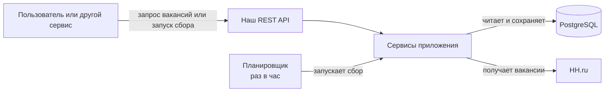
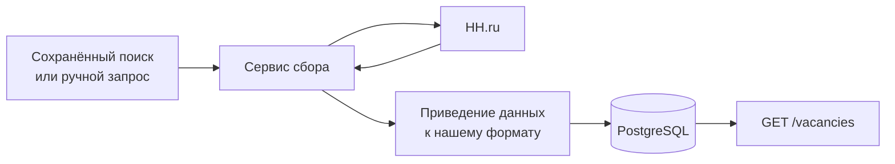
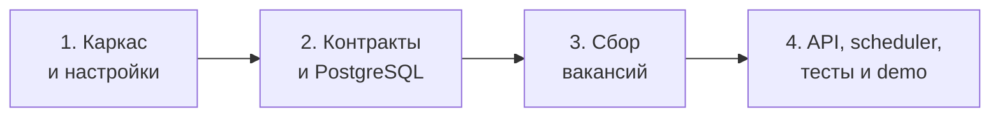
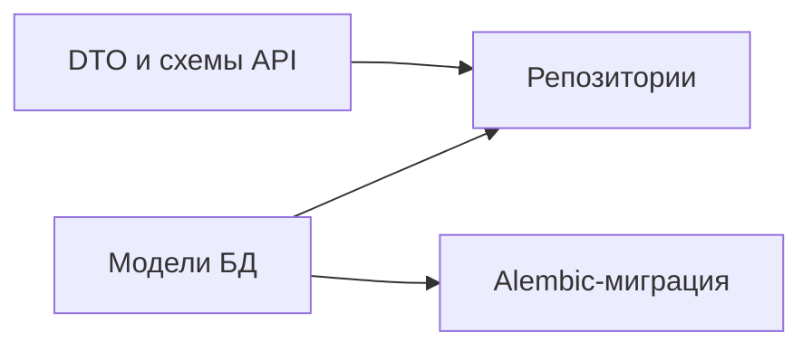
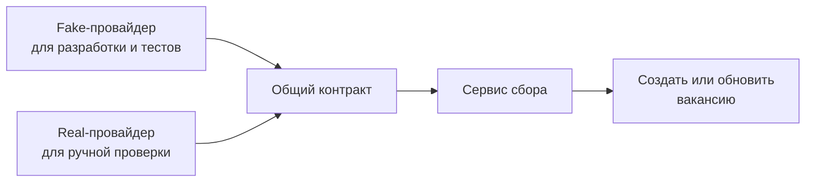
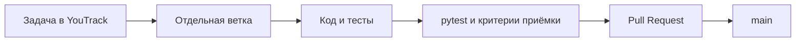
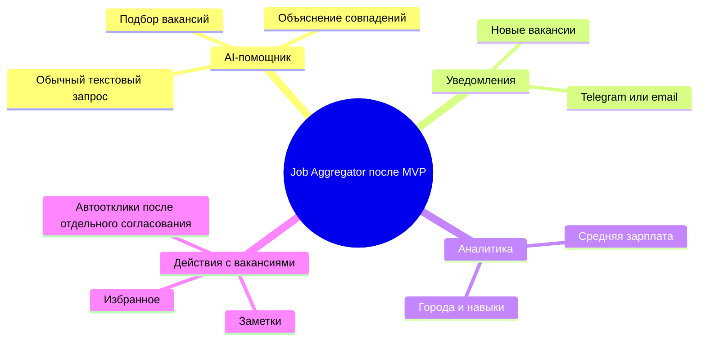

# Карта реализации Job Aggregator

Это общая карта разработки для команды: что мы создаём, в каком порядке части
проекта соединяются и что можно добавить после MVP.

## Что мы строим

Job Aggregator — backend-сервис, который собирает вакансии разработчиков с HH.ru,
сохраняет их в PostgreSQL и предоставляет через собственный REST API.

Команда разработки — StackEight.

Пользователь сможет создать поисковый запрос, запустить сбор вручную или по
расписанию, а затем получить сохранённые вакансии с фильтрами и ссылкой на
исходную вакансию.

## Актуальная техническая спецификация

Это уточнение технических решений команды. Продуктовые требования исходного ТЗ
остаются основой проекта.

| Область | Решение команды |
| --- | --- |
| Источник вакансий | HH.ru |
| Хранилище | PostgreSQL |
| REST API | FastAPI |
| Работа с БД | SQLAlchemy 2.x и Alembic |
| Внешние запросы | aiohttp и asyncio |
| Плановый сбор | APScheduler, раз в час по умолчанию |
| Тесты | pytest, без сетевых вызовов к HH.ru |
| Конфигурация | environment variables и `.env` |
| Логи | стандартный Python logging |

Интеграция с HH.ru изолирована внутри приложения. `hh-applicant-tool` может
использоваться только там как helper для OAuth и API-транспорта. Токены,
хранение токенов и правила их обновления принадлежат нашему приложению.

## Простая архитектура

### Как проходит сбор вакансий

## Этапы разработки

### 1. Каркас и настройки

**Зачем:** все участники одинаково запускают backend, тесты и PostgreSQL.

**Результат:** `uv run` видит пакет, настройки читаются из `.env`, локальная
PostgreSQL запускается через Docker Compose.

**Задачи:**

- [JA-4 — Инициализировать Python-проект на uv](https://StackEight.youtrack.cloud/issue/JA-4)
- [JA-7 — Настроить конфигурацию через переменные окружения](https://StackEight.youtrack.cloud/issue/JA-7)
- [JA-10 — Подготовить локальный PostgreSQL через Docker Compose](https://StackEight.youtrack.cloud/issue/JA-10)
- [JA-14 — Добавить базовую модель Base и timestamps](https://StackEight.youtrack.cloud/issue/JA-14)

### 2. Контракты и PostgreSQL

**Зачем:** команда заранее договаривается о данных, не ожидая готового HH.ru
или API.

**Результат:** DTO, ORM-модели, миграции и репозитории для вакансий, токенов и
сохранённых поисков.

**Задачи контрактов:**

- [JA-19 — Описать схему ответа вакансии](https://StackEight.youtrack.cloud/issue/JA-19)
- [JA-20 — Описать параметры списка вакансий](https://StackEight.youtrack.cloud/issue/JA-20)
- [JA-21 — Описать схемы ручного запуска сбора вакансий](https://StackEight.youtrack.cloud/issue/JA-21)
- [JA-53 — Добавить DTO параметров поиска вакансий HH.ru](https://StackEight.youtrack.cloud/issue/JA-53)
- [JA-22 — Описать DTO результата поиска и контракт HHVacancyProvider](https://StackEight.youtrack.cloud/issue/JA-22)

**Задачи хранения:** JA-13–JA-18, JA-26, JA-33, JA-34, JA-40 и JA-54.

### 3. Сбор вакансий

**Зачем:** получить вакансии, привести к единому виду и сохранить без дублей.

**Результат:** сервис собирает одну страницу, несколько страниц и несколько
активных поисков параллельно.

**Задачи:** JA-23–JA-28, JA-35–JA-36, JA-41–JA-43, JA-46 и JA-47.

### 4. API, автоматизация и защита

**Зачем:** показать работающий сервис пользователю и на защите.

**Результат:** есть API вакансий, ручной сбор, OAuth-статус, scheduler раз в
час, тесты и demo-сценарий.

**Задачи:** JA-29–JA-32, JA-37–JA-39, JA-44–JA-45 и JA-48–JA-52.

## Что команда делает сейчас

| Приоритет | Задача | Что она открывает |
| --- | --- | --- |
| Критично | JA-4: `uv` и пакет из `src` | нормальный запуск backend и CI |
| Критично | JA-7: настройки | PostgreSQL, HH-режимы, scheduler |
| Высокий | JA-10: Docker PostgreSQL | модели, миграции и репозитории |
| Высокий | JA-14: timestamps | модели вакансий, токенов и поисков |
| Высокий | JA-53: параметры поиска HH.ru | контракт и провайдеры HH.ru |
| Параллельно | JA-19, JA-20, JA-21 | API без ожидания БД |

## Рабочий процесс команды

Перед началом задачи нужно открыть ссылки на поставляющие контракты в её
описании. Перед ревью — выполнить `uv run pytest`.

## Направления роста после MVP

Эти ветки не блокируют обязательный MVP.

### AI-помощник

Пользователь пишет обычный текст: «Хочу удалённую Python-вакансию junior или
middle с PostgreSQL». AI-помощник преобразует его в фильтры или ранжирует уже
сохранённые вакансии. Он работает поверх нашего API и PostgreSQL, не заменяя
основной сбор вакансий.

### Автоотклики и дополнительные действия

Это отдельная ветка после MVP. Для неё потребуется явное согласие пользователя,
проверка правил внешнего сервиса и отдельная модель безопасности. Она не входит
в текущий критический путь.

## Как использовать карту

1. На синке открыть этот файл или `implementation-roadmap.excalidraw`.
2. Найти свой этап и задачу в YouTrack.
3. После merge сверить, какие следующие задачи разблокированы.
4. Обновлять карту только при изменении архитектурного решения или этапов MVP.

Для Miro используйте `implementation-roadmap.drawio`: импортируйте файл через
**Shapes and lines → More shapes → Import diagram**. После импорта элементы и
стрелки можно редактировать прямо на доске.
